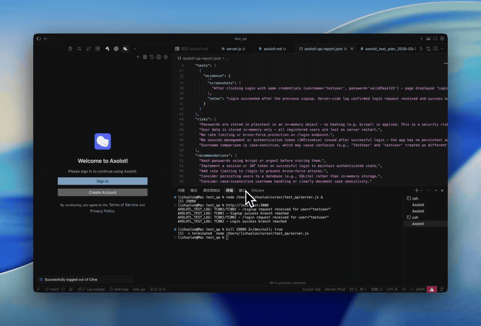

<p align="center">
  
</p>

<h1 align="center">Axolotl</h1>

<p align="center">
  <strong>AI that tests your code before you merge it.</strong>
</p>

<p align="center">
  Point it at a PR. It reads the diff, analyzes the code, generates tests,<br/>
  opens a real browser, clicks through your app, and tells you if it's safe to ship.
</p>

<p align="center">
  <a href="https://qaxolotl.com"></a>&nbsp;
  <a href="https://github.com/Axolotl-QA/Axolotl/blob/main/LICENSE"></a>&nbsp;
  <a href="https://github.com/Axolotl-QA/Axolotl/stargazers"></a>
</p>

<br/>

<p align="center">
  
</p>
<p align="center"><em>Axolotl testing a live app — clicking buttons, checking responses, capturing evidence.</em></p>

<br/>

---

<br/>

## The Problem

You open a PR. You eyeball the diff. You run the existing test suite — it passes. You merge.

Two hours later, production breaks. The tests didn't cover the actual user flow that changed.

**Axolotl fixes this.** It reads your code changes, figures out what *should* be tested, and actually tests it — in a real browser, against your real app.

<br/>

---

<br/>

## See Every Step

<table><tr>
<td width="35%" valign="top">

### 1. Sign In

One-click Google sign in. Only used for future update notifications — **no usage data is collected**.

[Watch full video &rarr;](https://youtu.be/OxcI_s_Q4OI)

</td>
<td width="65%">



</td>
</tr></table>

<table><tr>
<td width="65%">


</td>
<td width="35%" valign="top">

### 2. Configure

Set your **Anthropic API key** and [You.com API key](https://api.you.com/) for web search. We recommend **Claude Sonnet 4.6 (1M)** — all browser testing is optimized for Sonnet.

[Watch full video &rarr;](https://youtu.be/_QrNSwnoKzw)

</td>
</tr></table>

<table><tr>
<td width="35%" valign="top">

### 3. Start a QA Session

Pick your source: a PR number, uncommitted changes, or specific files. Or just type in the chat box.

[Watch full video &rarr;](https://youtu.be/Gf--pxAJEIk)

</td>
<td width="65%">


</td>
</tr></table>

<table><tr>
<td width="65%">


</td>
<td width="35%" valign="top">

### 4. Code Analysis

Tree-sitter AST parsing + ripgrep pattern search. Axolotl understands your code structure before writing any tests.

[Watch full video &rarr;](https://youtu.be/dbvSSG2ABDw)

</td>
</tr></table>

<table><tr>
<td width="35%" valign="top">

### 5. Web Search & Test Cases

Searches for testing best practices specific to your tech stack, then generates targeted test cases.

[Watch full video &rarr;](https://youtu.be/VbObxj5kdeY)

</td>
<td width="65%">


</td>
</tr></table>

<table><tr>
<td width="65%">


</td>
<td width="35%" valign="top">

### 6. Plan & Log Injection

Review the test plan. On approval, Axolotl injects temporary log markers to capture behavioral evidence.

[Watch full video &rarr;](https://youtu.be/zK9ZrAGQGks)

</td>
</tr></table>

<table><tr>
<td width="35%" valign="top">

### 7. End-to-End Testing

Real browser. Real clicks. Real screenshots. Monitors frontend UI and backend output simultaneously.

[Watch full video &rarr;](https://youtu.be/osxX891zBEM)

</td>
<td width="65%">


</td>
</tr></table>

<table><tr>
<td width="65%">


</td>
<td width="35%" valign="top">

### 8. Report & Memory

Evidence-backed verdict with pass/fail per test case. Axolotl remembers your project setup for next time.

[Watch full video &rarr;](https://youtu.be/rq-h5USFsMA)

</td>
</tr></table>

<br/>

---

<br/>

## Quick Start

### 1. Clone & Install

```bash
git clone https://github.com/Axolotl-QA/Axolotl.git
cd Axolotl
npm install
npm run build:webview
npm run dev
```

Press **F5** to launch the Extension Development Host.

### 2. Configure

| Setting | Value | Why |
|---------|-------|-----|
| **Model** | Claude Sonnet 4.6 (1M) or Opus 4.6 | All browser testing is optimized for Sonnet. Other models produce inconsistent results. |
| **Provider** | [Anthropic](https://console.anthropic.com/) | Direct API access, best performance. |
| **Web Search** | [You.com API key](https://api.you.com/) | Enables research on testing best practices. Significantly improves test plan quality. |

### 3. Run

```
--source=pr --pr=123              ← test a pull request
--source=uncommitted              ← test your working changes
--source=files @src/auth.ts       ← test specific files
```

Or just describe what you want tested in the chat box.

<br/>

---

<br/>

## Why Axolotl

| | Traditional Testing | Axolotl |
|---|---|---|
| **Test creation** | You write and maintain test scripts | AI generates tests from code analysis |
| **Coverage gaps** | Tests cover what you thought to test | Tests cover what actually changed |
| **Browser testing** | Selenium/Playwright setup required | Built-in browser with screenshot evidence |
| **Maintenance** | Tests break when UI changes | Fresh tests every run, zero maintenance |
| **Evidence** | Pass/fail boolean | Screenshots, logs, behavioral markers |
| **Time to first test** | Hours to days | Minutes |

<br/>

---

<br/>

## Key Features

**Zero test maintenance** — tests are generated on-the-fly from your actual code changes. No test suite to maintain.

**Evidence-driven verdicts** — every result is backed by screenshots, console logs, and injected behavioral markers. Not just pass/fail.

**Human-in-the-loop** — you review the test plan, approve each phase, and decide what to do with the results.

**Persistent memory** — Axolotl remembers how to install deps, start your dev server, and run your app across sessions via `axolotl.md`.

**Web-informed** — searches the internet for testing best practices relevant to your specific tech stack before generating test cases.

**Multi-language analysis** — tree-sitter powered AST parsing for JavaScript, TypeScript, Python, Rust, Go, C/C++, C#, Ruby, Java, PHP, Swift, and Kotlin.

<br/>

---

<br/>

## Contributing

We'd love your help. See the [Contributing Guide](CONTRIBUTING.md) for details.

```bash
git clone https://github.com/Axolotl-QA/Axolotl.git
cd Axolotl
npm install
npm run dev            # watch mode
npm run build:webview  # build UI
# F5 to launch
```

<br/>

---

<br/>

## License

Apache 2.0 — see [LICENSE](LICENSE).

Built on [Cline](https://github.com/cline/cline). Extended for automated QA.
